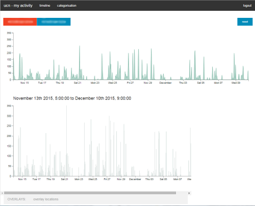

## UCN Visualisation Tools

### Overview

This set of tools were used to present web-based visualisations of browsing (squid logs and dns traces) and location data (from an app: [moves](https://dev.moves-app.com/) running on users' mobile phones).  There are three parts to the code: server, client and stats.  

### Server

The server is a nodejs application using the express framework, and provides an API for timerange queries across the  datasets (postgres database).  Data is written to the postgres database from [hostview](https://muse.inria.fr/EMD/Home.html) and a set of [scripts](./server/scripts) run periodically by cron that pull data from dns and squid logs.

The (http/dns) browsing schema is as follows:

#### Table "public.http3"

|     Column     |  Type   | Modifiers | Storage  | Description 
|----------------|---------|-----------|----------|-------------
| id             | integer |           | plain    | 
| httpverb       | text    |           | extended | 
| httpverbparam  | text    |           | extended | 
| httpstatuscode | text    |           | extended | 
| httphost       | text    |           | extended | 
| referer        | text    |           | extended | 
| contenttype    | text    |           | extended | 
| contentlength  | text    |           | extended | 
| protocol       | integer |           | plain    | 
| src            | inet    |           | main     | 
| dest           | inet    |           | main     | 
| sport          | integer |           | plain    | 
| dport          | integer |           | plain    | 
| timestamp      | bigint  |           | plain    | 

#### Table "public.dns"

|  Column   |          Type          | Modifiers | Storage  | Description 
|-----------|------------------------|-----------|----------|-------------
| id        | integer                |           | plain    | 
| type      | integer                |           | plain    | 
| ip        | character varying(260) |           | extended | 
| host      | character varying(260) |           | extended | 
| protocol  | integer                |           | plain    | 
| src       | inet                   |           | main     | 
| dest      | inet                   |           | main     | 
| sport     | integer                |           | plain    | 
| dport     | integer                |           | plain    | 
| timestamp | bigint                 |           | plain    | 

#### View "public.browsing"

|  Column   |  Type   | Modifiers | Storage  | Description 
|-----------|---------|-----------|----------|-------------
| id        | integer |           | plain    | 
| httphost  | text    |           | extended | 
| timestamp | bigint  |           | plain    | 

View definition:
         SELECT http3.id, http3.httphost, http3."timestamp"
           FROM http3
UNION ALL 
         SELECT dns.id, dns.host AS httphost, dns."timestamp"
           FROM dns;

The location schema is as follows:

#### Table "public.zones"

|   Column   |          Type          | Modifiers | Storage  | Description 
|------------|------------------------|-----------|----------|-------------
| date       | character varying(16)  |           | extended | 
| locationid | bigint                 |           | plain    | 
| deviceid   | integer                |           | plain    | 
| name       | character varying(128) |           | extended | 
| lat        | real                   |           | plain    | 
| lng        | real                   |           | plain    | 
| enter      | bigint                 |           | plain    | 
| exit       | bigint                 |           | plain    | 

User authentication registration is handled by a separate [server](https://github.com/ucn-eu/ucnserver).

### Client

The client code provides an interactive visualisation of browsing and location data.  The code is written using [react](https://facebook.github.io/react/), [FLUX](https://facebook.github.io/react/docs/flux-overview.html) and [d3](https://d3js.org/).  

	
	

### Stats

The stats code provided post-experiment analysis of the data, it was used to present classifications of users browsing habits and to pull out routines and activities.  The code is written using [react](https://facebook.github.io/react/), [FLUX](https://facebook.github.io/react/docs/flux-overview.html) and [d3](https://d3js.org/), though it hands all DOM maniputaltion to react rather than d3, and only uses d3 for visualisation functions (i.e no use of enter/exit/remove).
